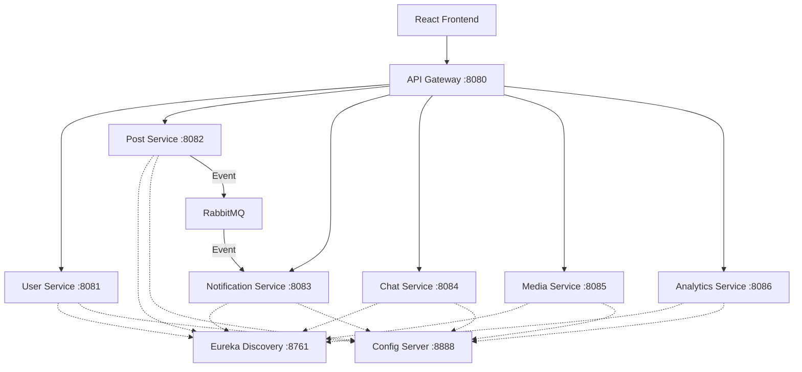

# 📱 Microservices-based Social Media Platform

A high-performance, distributed social media platform built with a microservices architecture using Spring Cloud, React, Docker, and RabbitMQ.

## 🚀 Overview

This platform is designed for high scalability and resilience, featuring 6+ independent microservices, a centralized API Gateway, and service discovery. It includes real-time communication via WebSockets and event-driven notifications.

### 🛠️ Technical Stack

- **Backend**: Spring Boot 3.2, Spring Cloud (Eureka, Gateway, Config)
- **Frontend**: React 18, Vite, Lucide Icons, Framer Motion
- **Database**: PostgreSQL (Production), H2 (Development)
- **Messaging**: RabbitMQ
- **DevOps**: Docker, Docker Compose
- **Design**: Modern Glassmorphism UI

## 🏗️ Architecture



## 📂 Project Structure

```text
social-media-platform/
├── frontend/             # React application (Vite)
├── api-gateway/          # Spring Cloud Gateway
├── service-discovery/    # Eureka Server
├── config-server/        # Distributed configuration
├── user-service/         # User management
├── post-service/         # Post management
├── notification-service/ # Async notifications
├── chat-service/         # Real-time WebSockets
├── media-service/        # File handling
├── analytics-service/    # User behavior tracking
└── docker-compose.yml    # Full stack orchestration
```

## 🔧 Prerequisites

- Java 17+
- Node.js 18+
- Docker & Docker Compose
- Maven 3.8+

## 📥 Getting Started

### 1. Clone & Build
```powershell
git clone <repository-url>
cd social-media-platform
mvn clean install
```

### 2. Launch Infrastructure
Start the core infrastructure (Eureka, Config, RabbitMQ, DB):
```powershell
docker-compose up -d eureka-server config-server rabbitmq postgres
```

### 3. Run Microservices
You can run each service via your IDE or:
```powershell
cd <service-folder>
mvn spring-boot:run
```

### 4. Run Frontend
```powershell
cd frontend
npm install
npm run dev
```

## 📟 Service Ports

| Service | Port | Description |
|---------|------|-------------|
| API Gateway | 8080 | Central Entry Point |
| Eureka Server | 8761 | Service Discovery |
| Config Server | 8888 | Configuration Management |
| User Service | 8081 | Auth & Profiles |
| Post Service | 8082 | Feed & Content |
| Notification Svc | 8083 | Messaging & Alerts |
| Chat Service | 8084 | WebSockets Chat |
| Media Service | 8085 | Uploads |
| Analytics Service | 8086 | Behavior Tracking |

## 🛡️ Resilience & Observability

- **Circuit Breaker**: Resilience4j implemented for inter-service calls.
- **Service Discovery**: Netflix Eureka for dynamic scaling.
- **Config Server**: Centralized property management (Native/Git).
- **Traced ID**: Integrated Sleuth for request tracing.

## 🎨 UI Design

The frontend features a **Premium Dark Glassmorphism** aesthetic:
- **Translucent Surfaces**: Backdrop-blurs and subtle borders.
- **Animated Interactions**: Smooth transitions using Framer Motion.
- **Visual Excellence**: Curated Inter & Outfit typography.

---

